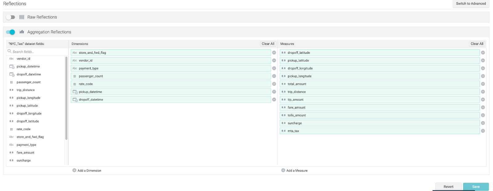
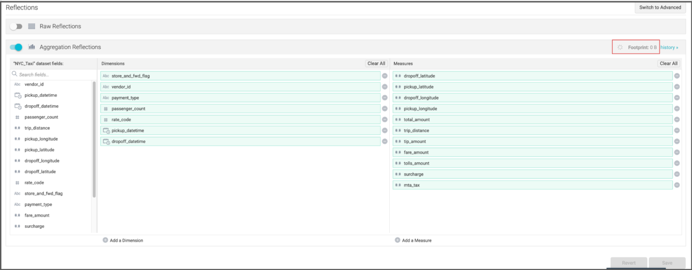
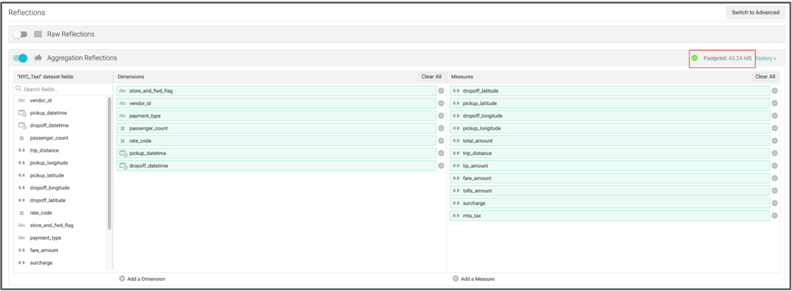

+++
title = "Setting up a Data Reflection"
chapter = true
weight = 505
+++

 <ol>
       <li> Click on the <b>“Reflection”</b> Tab.  
        

</li>

    Reflections are physically optimized representations of source data that Dremio maintains in order to accelerate query performance.  Dremio can accelerate a query by utilizing one or more Data Reflections to partially or entirely satisfy that query, rather than processing the raw data in the underlying data source.  There are various types of Data Reflections:

</ol>
<ul>
<li>
Raw reflections – A raw reflection includes one or more fields from the anchor dataset, sorted, partitioned and distributed by specific fields.
    Aggregation reflections – An aggregation reflection includes one or more dimension and measure fields from the anchor dataset, sorted, partitioned and distributed by specified fields.
</li>

 
<li>
Aggregation reflections – An aggregation reflection includes one or more dimension and measure fields from the anchor dataset, sorted, partitioned and distributed by specified fields.

</li>
</ul>
When you clicked on the <b>“Reflection”</b> Tab, Dremio will automatically determine the Aggregation Reflection based on the measures and dimensions in the table.  
<ol start=2>
        <li>Toggle on the <b>“Aggregation Reflection”</b> and click Save.  Dremio will create the reflection.   
</li>
 

        
       This could take a few minutes to complete. You will notice that next to “footprint” there will be a spinning wheel while Dremio is creating the reflection.  

   
        When the reflection has been created, you will see a green check mark and a space size next to “footprint”.  
       
    </ol>

